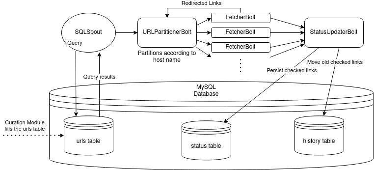

# Stormychecker
Stormychecker is a Storm Crawler adaptation for URL checking. Instead of crawling, it checks the status of URLs and persists them in a database.

# Setup and Run Local Mode

0. Before you can run stormychecker, you need to install ApacheStorm: Download Apache Storm 1.2.2 (current supported version) from this link: https://archive.apache.org/dist/storm/apache-storm-1.2.2/apache-storm-1.2.2.tar.gz

1. Clone this repository.

2. Run `mvn install` in the working directory

3. Run *tableCreation.sql* on your mysql database. It requires a database with the name *stormychecker*. You can change the database name and the table names in the script but then you would have to change the *crawler-conf.yaml* configuration for those parameters as well.

4. Add your mysql url and login parameters to *crawler-conf.yaml* (and change any other parameters you wish, ex: http.agent):
      ```
      sql.connection:
      url: {your mysql url, ex: "jdbc:mysql://localhost:3307/stormychecker"}
      user: {your mysql username}
      password: {your mysql password}
      rewriteBatchedStatements: "true"
      useBatchMultiSend: "true"
      ```
5. Point to your crawler-conf.yaml file in *crawler.flux*:
      ```
      includes:
        - resource: true
          file: "/crawler-default.yaml"
          override: false
    
        - resource: false
          file: {path to your crawler-conf.yaml file}
          override: true
      ```
    Note: If you set it "crawler-conf.yaml", then you can directly use the crawler-conf.yaml in this repository.

6. To start stormychecker on local mode, run `apache-storm-1.2.2/bin/storm jar path/to/this/repository/target/stormychecker-1.0-SNAPSHOT.jar  org.apache.storm.flux.Flux --local path/to/this/repository/crawler.flux --sleep 86400000`
  
    Note: Local Mode has an expiration time parameter that has to be provided, which means the application will shut down after a while. To see how to run indefinitely, see below.
  
# Setup and Run Remote Mode
0. To run local mode, you need Apache Zookeeper and Apache Storm.

1. Bulding this project is the same as explained above.

2. You need to start Zookeeper and Storm. You also need to start Nimbus and Supervisor 
(provided in Storm folder). You can see how it is done [here](https://gitlab.com/CLARIN-ERIC/docker-stormychecker/-/blob/master/image/start-cluster.sh).

Note: Although it's called remote mode, it can all be run on the same server. 

# Architecture



Our MySQL database has 4 tables:
1. **urls:** This is the table that stormychecker reads from. So this will be populated by 
another application (in our case curation module).
2. **status:** This is the table that stormychecker saves the results into.
3. **history:** This is the table where links are saved if they were checked more than one time. 
So if a link is already in the `status` table and is checked again, then the old checked link is moved here.
4. **metrics (Not important):** This table is filled by default storm-crawler behaviour in FetcherBolt and has some statistics information. It is not really important for stormychecker.

*crawler.flux* defines our topology. It defines all the spouts, bolts and streams.
1. **SQLSpout:** reads from the `urls` table in the database and sends the urls to the URLPartitionerBolt. Its query is sorted according to the nextfetchdate column.
2. **URLPartitionerBolt:** partitions the URLS according to their host name.
3. **FetcherBolt:** fetches/checks the urls (sends requests to the urls). It sends redirects back to URLPartitionerBolt and sends the rest onwards down the stream to StatusUpdaterBolt.
4. **StatusUpdaterBolt:** persists the results in the `status` table in the database. It also persists nextfetchdate and host columns in the urls table.

# Logging
There are multiple logs if you deploy stormychecker in the cluster mode.
You can look into the logs for the different programs (apache storm, apache zookeeper) in their respective folders. 
To view the logs for the workers of the topology, you need to go into `.../{apache storm folder}/logs/workers-artifacts/stormychecker-1-.../670*/`.

### Build and Deployment
The application is built as a Docker image and pushed to the Clarin Docker registry via the [docker-stormychecker](https://gitlab.com/CLARIN-ERIC/docker-stormychecker) project.
This image is then deployed together with the Curation Module on the Clarin server via [compose_curation_module_stormychecker](https://gitlab.com/CLARIN-ERIC/compose_curation_module_stormychecker) project. 


